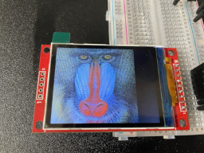
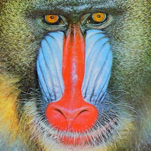
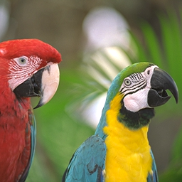
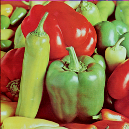
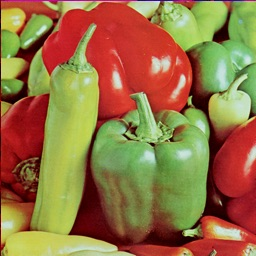

# MPIC

Simple Lossy Compression Image Format for Embedded Platforms



- [Repository](https://github.com/neri/mpic)
- [Online API Documents](https://neri.github.io/mpic/mpic/)

## Features

- Simple.
- Lossy compression.
- A typical image compression ratio is somewhere between PNG and JPG.
- Small memory footprint, only a few hundred bytes of stack memory required for decoding.
- Designed for 16bpp color images and supports `embedded-graphics`; add `features = ["embedded"]` to Cargo.toml.
- Support for `no_std`, No `alloc` is needed for decoding.

## Example Apps

### `/cli`: Command Line File Converter

- Example of a command line application that converts files in MPIC format and other formats such as PNG to each other

```sh
$ cargo run -p cli INFILE OUTFILE
```

### `/viewer`: Image Viewer

- Example of a GUI application that displays MPIC format files with `embedded-graphics`

```sh
$ cargo run -p viewer FILE_NAME
```

## Other Apps

- [Online Image Viewer](https://github.com/neri/image-viewer)

----

## How it works

- Divide the image into blocks of 8 x 8 pixels.
- Convert RGB with 8 bits per channel to YUV with 6 bits per channel.
- Thin out the U and V channels to 1/4.
- Because the color difference information is thinned out, even in the worst case, the compression is guaranteed to be more than half of the raw bitmap.
- Finally, lossless compression is performed using the sliding dictionary method.
- When decoding, these processes are performed in reverse order.

## Comparison with sample images

| Mandrill              | Original Size | Converted PNG Size |                              |
| --------------------- | ------------- | ------------------ | ---------------------------- |
| Original 24bit Bitmap | 197KB         | 155KB              |  |
| MPIC                  | 72KB          | 135KB              |      |
| JPEG                  | 40KB          | -                  |     |

| Parrots               | Original Size | Converted PNG Size |                             |
| --------------------- | ------------- | ------------------ | --------------------------- |
| Original 24bit Bitmap | 197KB         | 105KB              |  |
| MPIC                  | 49KB          | 87KB               |      |
| JPEG                  | 21KB          | -                  |     |

| Pepper                | Original Size | Converted PNG Size |                            |
| --------------------- | ------------- | ------------------ | -------------------------- |
| Original 24bit Bitmap | 197KB         | 117KB              |  |
| MPIC                  | 58KB          | 105KB              |      |
| JPEG                  | 28KB          | -                  |     |

## File Format

### File Header

- All multi-byte data is encoded in little-endian.

```
#[repr(C, packed)]
pub struct FileHeader {
    magic: [u8; 4], // b"\x00mpi"
    width: u16,
    height: u16,
    version: u8,    // The current version is 1.
}
```

#### Differences between versions

- In version `0`, only multiples of 8 are allowed for `width` and `height`.
- There is no limit to image size in version `1` or later.


### Image Data

- Image data follows the header.
- Image data is divided into 8 x 8 blocks and stored in chunks.
- If the image size is not a multiple of 8 x 8, the right and bottom edges are filled with a color interpolated from the surroundings to match a multiple of 8.
- Number of Chunks = ceil(`width` / 8) * ceil(`height` / 8)

### Chunk

- The first byte of each chunk of data indicates the data size, followed by the payload. The chunk size also indicates how the chunks are compressed.
- For uncompressed chunks, the data size (96), followed by the 64-byte Y channel, 16-byte U channel, and 16-byte V channel. `96` also serves as an identifier for uncompressed data. In practice, normal encoders do not use this mode.
- The Y channel stores all 8x8 data, while the U and V channels store only 4x4 pixels. The method of thinning the U and V channels is left to the encoder. The decoder should use nearest-neighbor interpolation to expand them by a factor of 2 in height and width.
- For a 6-bit compacted chunk, the data size is `72`. The order of the data is the same as for the uncompressed chunk, but the 6 bits of the uncompressed chunk are compacted into 8 bits, so the data size is 3/4 of the uncompressed chunk.
- If the data size after compression exceeds 72 with other compression methods, the 6-bit compaction method shall be selected.

### Color Conversion Methods

* RGB888 to YUV666

```
    y = ((66 * r + 129 * g + 25 * b + 128) >> 10) + 4;

    u = (((-38 * r - 74 * g + 112 * b + 128) / 256) + 128) >> 2;

    v = (((112 * r - 94 * g - 18 * b + 128) / 256) + 128) >> 2;
```

* YUV666 to RGB666 or RGB888

```
fn u6_to_u8(val) {
    (val << 2) | (val >> 4)
}

    y = u6_to_u8(y - 4);
    u = (u6_to_u8(u) - 128);
    v = (u6_to_u8(v) - 128);

    r6 = ((298 * y + 409 * v + 128) >> 10).clamp(0, 63);
    g6 = ((298 * y - 100 * u - 208 * v + 128) >> 10).clamp(0, 63);
    b6 = ((298 * y + 516 * u + 128) >> 10).clamp(0, 63);

    r8 = u6_to_u8(r6)
    g8 = u6_to_u8(g6)
    b8 = u6_to_u8(b6)
```

### LZ Compression Data Encoding

| Representation          | Meaning                                                                                                             |
| ----------------------- | ------------------------------------------------------------------------------------------------------------------- |
| `00vv_vvvv`             | Raw Value                                                                                                           |
| `01nn_nnnn` `00mm_mmmm` | Together with the trailing byte value, it indicates the length `(n+3)` and offset `-(m+1)` of the slide dictionary. |
| `01xx_xxxx` `NNxx_xxxx` | RESERVED (NN!=00)                                                                                                   |
| `1nnm_mmmm`             | Short form of sliding dictionary, it indicates the length `(n+2)` and offset `-(m+1)`.                              |

----

## License

MIT

(C) 2023 Nerry
